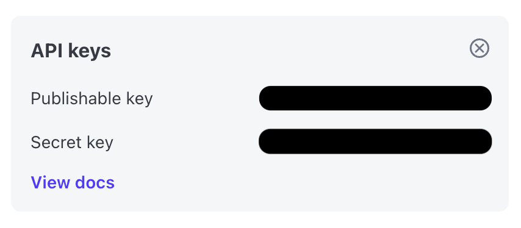
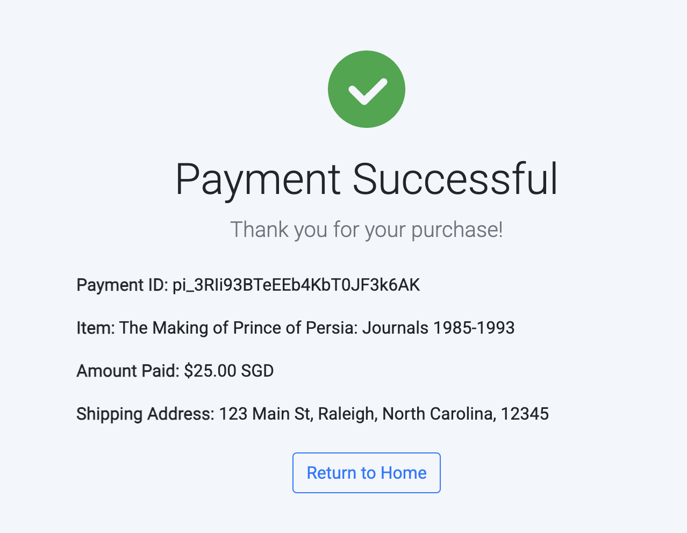

# Take home project
This is a simple e-commerce application that a customer can use to purchase a book, but it's missing the payments functionality — your goal is to integrate Stripe to get this application running!

# How does the solution work?
The solution uses Flask as a lightweight web framework for python. It utilises web server libraries such as Werkzeug and WSGI in the backend. It also allows us to use features such as:

- Async / Await
- An interactive debugger

This is a Flask application using HTML rendering and API calls to add Stripe Element into the project.

# Setup Instructions
To launch the project locally, you'll have to set up the correct environment and dependencies required by the application. 

1. Download the repository from Github.
    ```
    git clone https://github.com/fonghoujun/sa-takehome-project-python.git
    ```
2. Navigate to the Stripe environment (Sandbox or Production) and identify your `Secret Key` and `Publishable Key`. They can be found on the top right corner of the dashboard or in [api keys](https://dashboard.stripe.com/test/apikeys).
    

3. Navigate to `.env` and fill in the `STRIPE_SECRET_KEY` and `STRIPE_PUBLISHABLE_KEY` fields.
4. Navigate to `app.py` and replace `stripe.api_key = 'sk_test_abc123'` with your `STRIPE_SECRET_KEY`.
5. Navigate to `custom.js` and replace `stripe = Stripe('pk_test_abc123');` with your `STRIPE_PUBLISHABLE_KEY`.
6. Create a virtual environment that will house all your requirements for the application
    ```
    python3 -m venv .venv
    . ./venv/bin/activate
    pip3 install Flask
    pip3 install -r requirements.txt
    ```
7. Once the virutal environment is activated, you can run the `flask run` command in your terminal.
8. The local server will be activated at http://127.0.0.1:5000
    

# Navigating through the application
To use the application, you would have to click on a book to purchase, which will direct you to the checkout page.

Next, please input your shipping and payment details. A sample address will work as this application does not validate whether the address exists. Please use `4242 4242 4242 4242` as your sample card.

Finally, the application will show you your Stripe payment ID and shipping details.



# Resources
Documentation used to complete this project
- CreatePaymentIntent API Documentation - https://docs.stripe.com/api/payment_intents/create
- Reference for Payments Integration - https://docs.stripe.com/payments/quickstart
- Handling HTML and CSS with Python - https://realpython.com/html-css-python/#handle-html-with-python
- A significant amount of Googling 

# Approach to the Assignment
When starting the assignment, it required me to implement Stripe Elements payment system into the application. As I did not have much experience with frontend and frontend-backend integration, I had spent quite a bit of time learning on communication. 

After looking through the template code, I had to identify where to implement `CreatePaymentIntent` within the application. While implementing this, I had to refer back to the console output from the browser to look for any errors that occurred going through the steps. Once the payment details showed up in the Stripe dashboard, I then proceeded to write out a simple `success.html` page to display the `Payment ID`, `Item Name`, `Amount Paid` and `Shipping Address`.

# Challenges
The biggest challenge I had was learning simple HTML and CSS implementation with Python. I had spent a fair bit of time googling through the template code provided and how clicking each button will redirect the user to the next page.

# Improvements to the application
Here are some ways that I will improve / extend the functionality of the application.

### Email Confirmation
I would implement a mechanism to send an Email Confirmation with the order details to the email provided by the customer. This could be done by using Zapier, Mailgun and Stripe as the email workflow.

Reference - https://zapier.com/apps/mailgun/integrations/stripe

### Caching
While implementing the application, I had to input my checkout details every time the server was restarted. I would implement a way to cache the customer's information. 

### Cart system
Right now, it only allows customers to checkout one book at any time. I would implement a cart system where customers have the ability to add multiple books into their cart. I will also use `caching` mentioned in the previous improvement to ensure that the selections done by the customer are saved.  

### Implement Stripe Radar
I would add an additional layer of fraud detection with Stripe Radar. With the simplicity and customisable nature of Stripe Radar, enabling it would give an additional layer of security for the application.

### Add more ways to pay
Based on the location of the item that was purchased, this would introduce different ways to pay for an item outside of using a credit card. 

# Key Takeaways
Overall, this has been a really fun take home project that I've done. It has given me a deeper understanding of the flexibilites and features of using Stripe. It has also given me a glimpse of full stack development giving me a deeper appreciation of all developers world wide. 